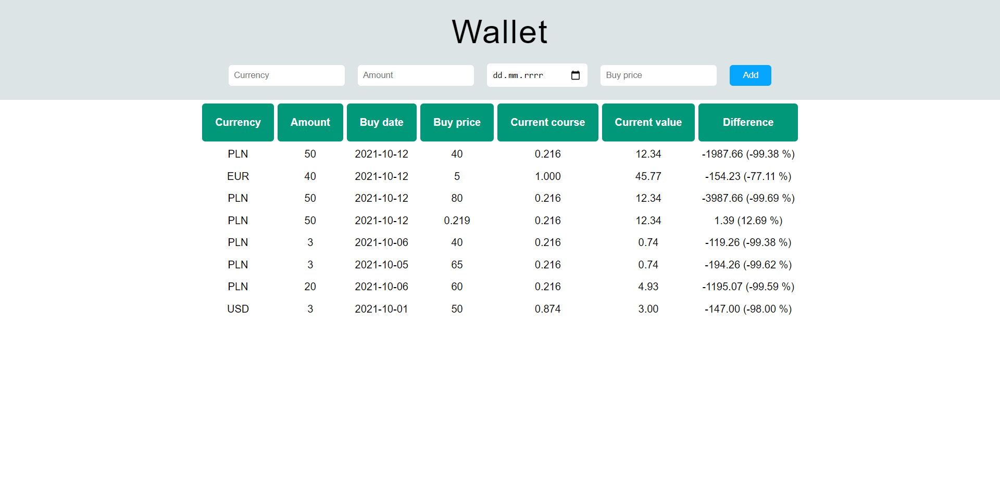

# Currency Wallet

Currency wallet is an application that will calculate the potential profit or loss of currencies. The user will be able to enter detailed information related to the currencies owned (type of currency, quantity, purchase date, purchase price). The app adds data to local storage, currency price is getting from [Exchangerates API](https://exchangeratesapi.io/).

**Main features**:
- React
- Redux
- Styled Components
&nbsp;
 
## 💡 Technologies

&nbsp;
 
## 💿 Installation

The project uses [node](https://nodejs.org/en/) and [npm](https://www.npmjs.com/). Having them installed, type into the terminal: `npm i`.
You also need `API key` from [exchangeratesapi](https://exchangeratesapi.io/), then you have to create `apiKey` file in `data` folder and `export` your apiKey.
&nbsp;

## 🙋‍♂️ Feel free to contact me

Find me on...

	
	
    

&nbsp;

## 👏 Thanks / Special thanks / Credits

To my [Mentor - devmentor.pl](https://devmentor.pl/) - for providing me with this task and for code review.
